# Introduccion a CSS

> Vamos a hablar de `display` y sus variaciones, cada utilidad que va a tener cada elemento

## POSITION
> Es la propiedad que te permite , poder  mover los elementos, segun tus necesidades.

### RELATION

> Podemos mover los elementos a nuestro antojo, teniendo en cuenta que tu posicion, si influye, se conciera dentro del contenedor.

### ABSOLUTE

> Al darle esta propidad, el desaparece el bloque y se puede mover segun su necesidad


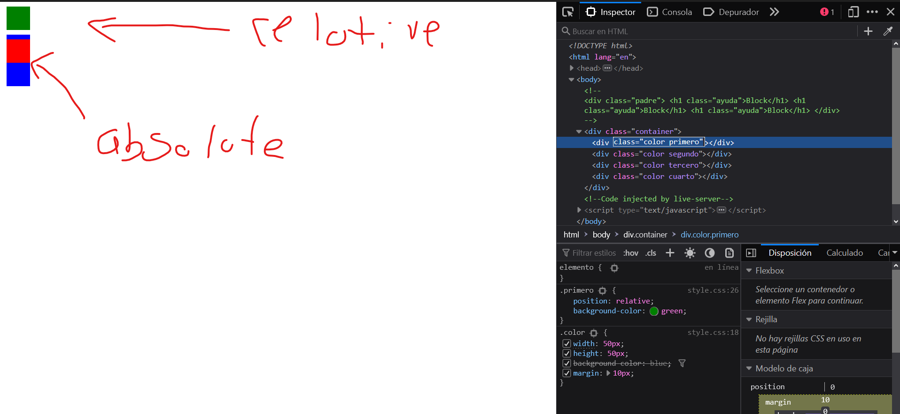


> Una de las utilidades que puedes usar, es al darle un sombreado a las imagenes.

```CSS
.container{
    background-image: url(img/flex-1.png);
    background-repeat: no-repeat;
    background-size: cover;
    height: 50rem;
    background-position: center center;
    position: relative;
}

.primero{
    position: absolute;
    bottom: 0;
    left: 0;
    top: 0;
    right: 0;
    background-color: rgba(0, 0, 0, 0.6);
}

```

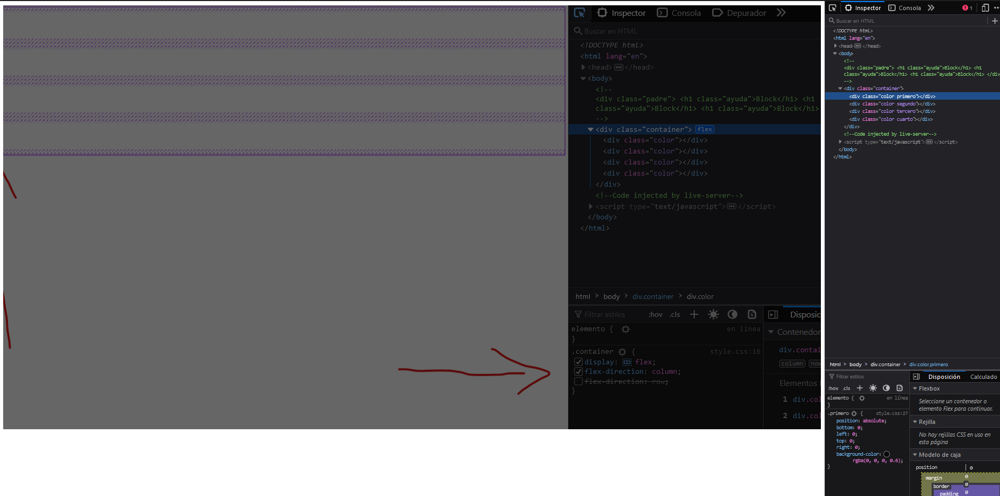


## DISPLAY

> Es una propiedad  de css que nos permite a posicion de elementos, cada cada propiedad que nos ofrece, tiene sus ventajas y desventajas, hay que tener en cuanta que esta propiedad se le aplica al hijo, mas no al padre.

### DISPLAY: BLOCK
> Al usar esta propiedad, nos va a primitir poner multiples etiquetas en una sola fila,`osea una debajo de la otra`, (cabe aclarar que hay etiquetas con esta funsion)

```CSS
<div>.- elemento contenedor.
<p>, <h1>, <h2>, <h3>, <h4>, <h5>, <h6>.- párrafos y textos encabezados.
<ul>, <ol>, <li>.- los elementos de lista.
<table>, <tr>, <td>.- elementos de tabla.
<dl>, <dd>, <dt>.- los elementos de definiciones.
```

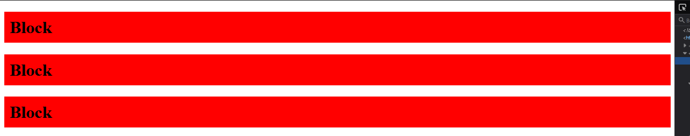

> Una de las ventajas, de usas display:block, es que te permite usar padding, margin y el width. (es como un cuadrado que le puede, dar posicion y apariencia)

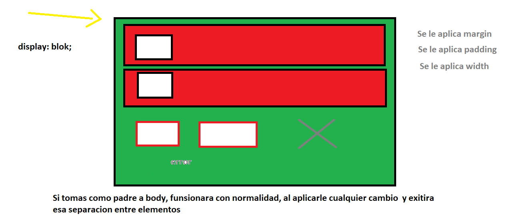


### DISPLAY: INLINE

> Creo que es una de las utilidades mas extrañas de entender, ya que tienes que primero, display:inline, toma al padre como base, es decir que al el, le vas a dar la movilidad de margin, mas no al hijo, como sabemos tampoco funciona el `width` aqui. 

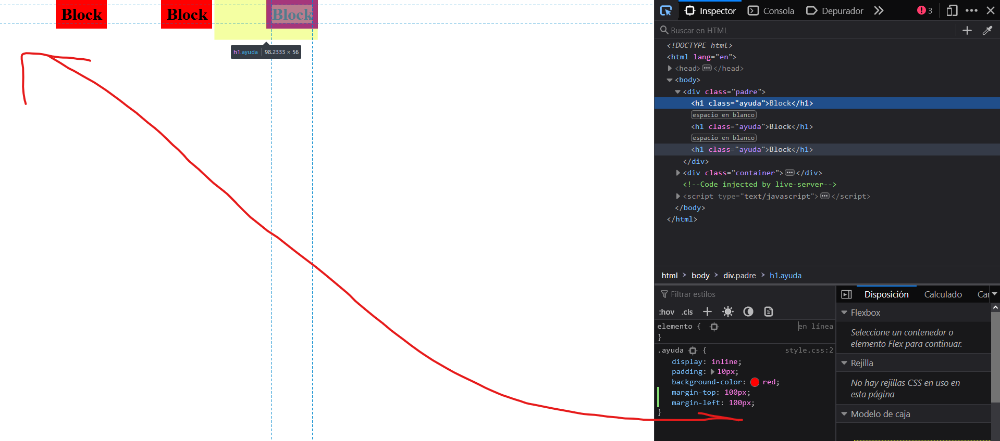

> Teniedo esta idea, el margin va a funcionar respeto al padre pero si toma a `body` como padre, no podra tener movilidad hacia arriba, usando `margin-top`


### DISPLEY: INLINE-BLOCK

> Es la union de `display:block y display:inline`, sacando las mejores propiedades de cada uno, como asi. `INLINE`, te permite poner elementos uno a lado del otro y `BLOCK`, te permite usar las propiedades de width y margin.

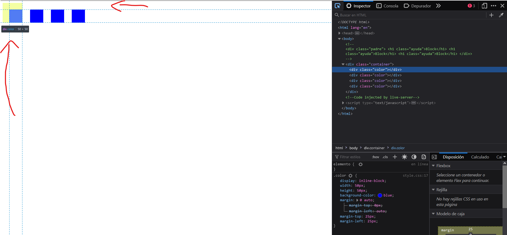


### DISPLEY: FLEX

> Es una de las propiedades, para que funsione bien, tiene que enteder el concepto de columna y fila;

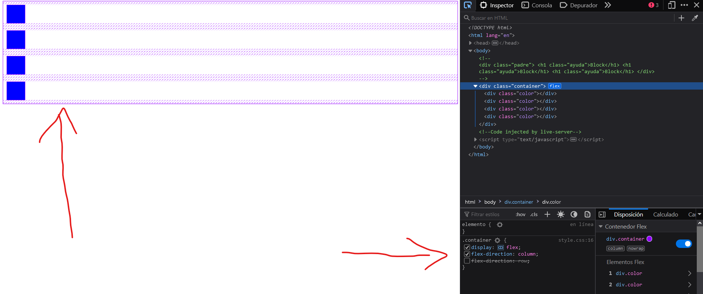

#### FLEX-DIRECTION: COLUMN

``` CSS
.container{
    display: flex;
    flex-direction: column;
}
> Propiedades
    align-items: flex-end;
    align-items: flex-start;
    align-items: center;

```
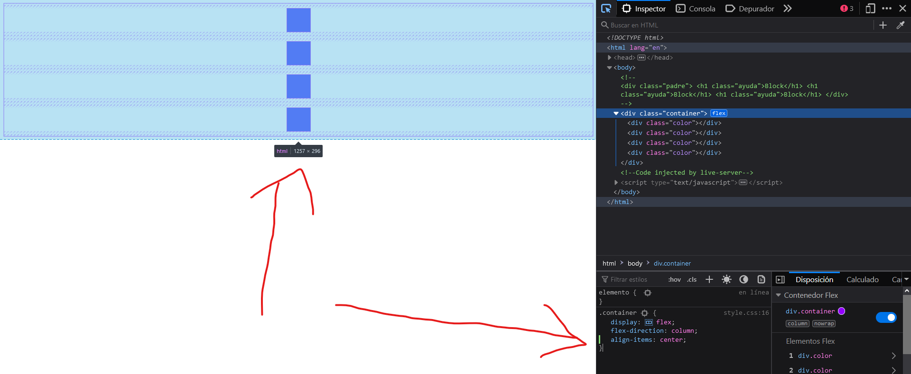
#### FLEX-DIRECTION: ROW

``` CSS
.container{
    display: flex;
    flex-direction: row;
}

> Propiedades de posicion
    justify-content: flex-end;
    justify-content: flex-start;
    justify-content: center;

> Propiedades de distribucion
    justify-content: space-between;
    justify-content: space-around;
    justify-content: space-evenly;

```
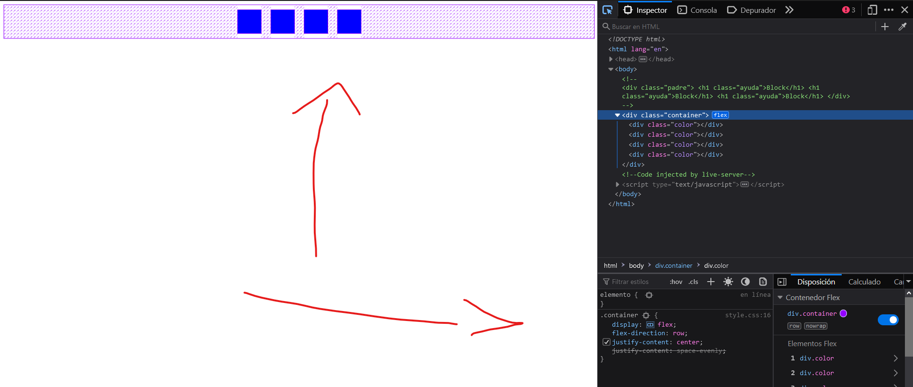

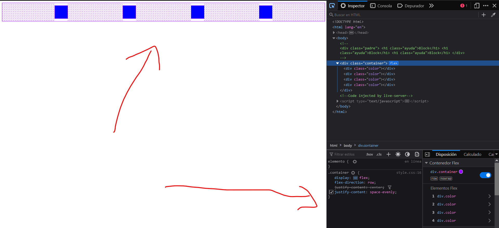


### DISPLEY: GRID            

> Esta propiedad de CSS, nos permite posicionar elementos de forma estructurada, algo que con `flex` se puede, pero es mas complicado, ya que a la hora de darle una posicion, se complica,algo que en `grid` es muy simple.

```CSS
.container{
 display:grid;
 grid-template-columns: repeat(4, 1fr) ;
 grid-template-rows: repeat(4, 1fr) ;

}
```

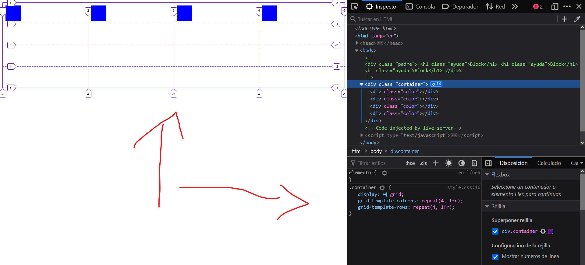

>  Hay que tener en cuenta, que el hijo se va a encargar de la posicion, es decir que a el, se le va hacer las modificaciones con codigo


```CSS
.container{
 display:grid;
 grid-template-columns: repeat(4, 1fr) ;
 grid-template-rows: repeat(4, 1fr) ;
}

.color{
    width: 50px;
    height: 50px;
    background-color:blue;
    margin: 10px;
}

.primero{
    grid-column: 1/3;
    grid-row: 1/3;
}

.segundo{
    grid-column: 2/3;
    grid-row: 2/4;

```

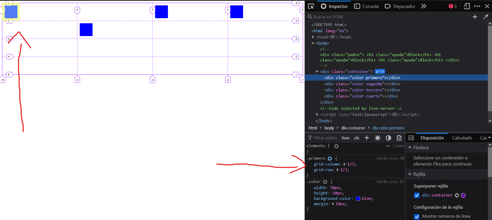


### CODIGO PARA AMBOS ELEMENTOS

> Hay codigo, funciona igual en `flex  como grid`


```CSS
gap: 2px;
```

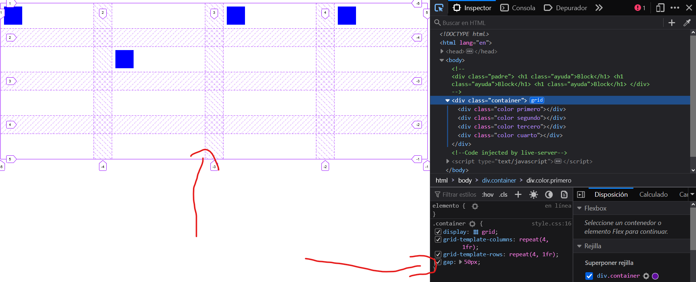