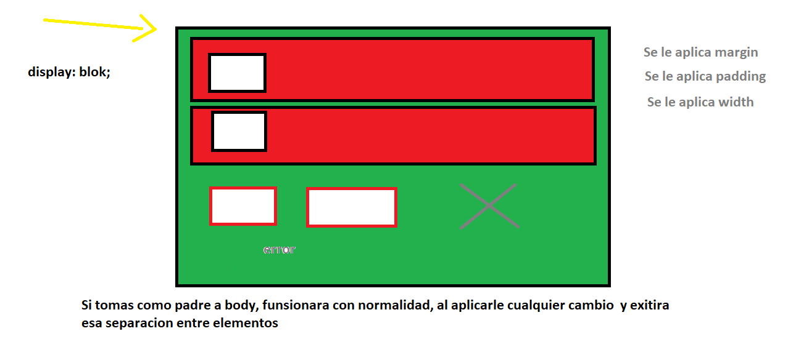
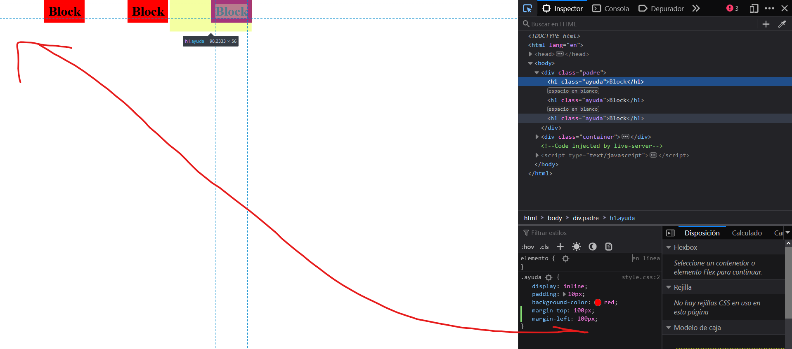
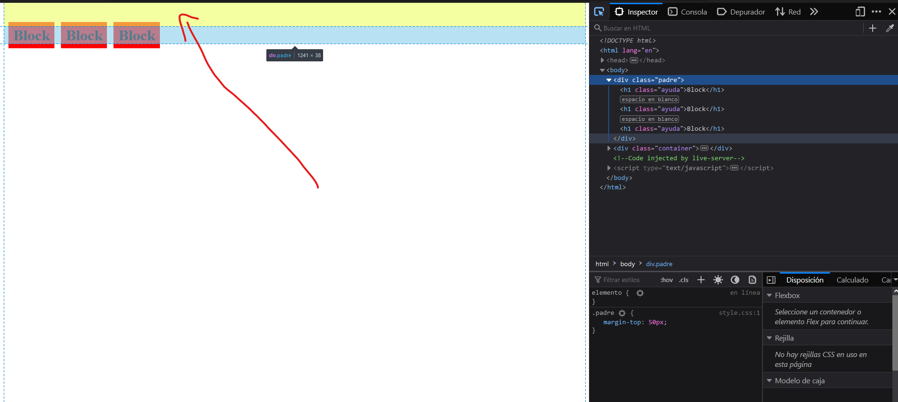
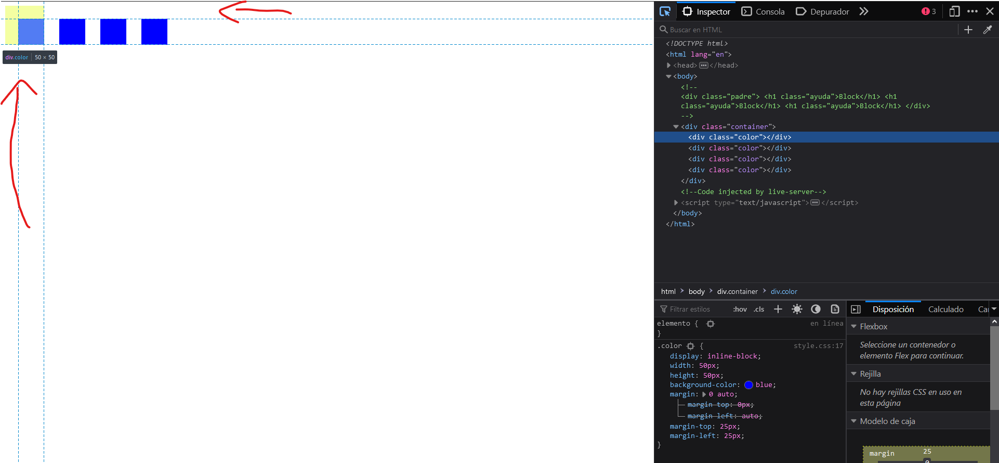

# Introduccion a CSS

> Vamos a hablar de `display` y sus variaciones, cada utilidad que va a tener cada elemento

## POSITION

### ABSOLUTE
### RELATION


## DISPLAY

> Es una propiedad  de css que nos permite a posicion de elementos, cada cada propiedad que nos ofrece, tiene sus ventajas y desventajas, hay que tener en cuanta que esta propiedad se le aplica al hijo, mas no al padre.

### DISPLAY: BLOCK
> Al usar esta propiedad, nos va a primitir poner multiples etiquetas en una sola fila,`osea una debajo de la otra`, (cabe aclarar que hay etiquetas con esta funsion)

```CSS
<div>.- elemento contenedor.
<p>, <h1>, <h2>, <h3>, <h4>, <h5>, <h6>.- párrafos y textos encabezados.
<ul>, <ol>, <li>.- los elementos de lista.
<table>, <tr>, <td>.- elementos de tabla.
<dl>, <dd>, <dt>.- los elementos de definiciones.
```


> Una de las ventajas, de usas display:block, es que te permite usar padding, margin y el width. (es como un cuadrado que le puede, dar posicion y apariencia)




### DISPLAY: INLINE

> Creo que es una de las utilidades mas extrañas de entender, ya que tienes que primero, display:inline, toma al padre como base, es decir que al el, le vas a dar la movilidad de margin, mas no al hijo, como sabemos tampoco funciona el `width` aqui. 



> Teniedo esta idea, el margin va a funcionar respeto al padre pero si toma a `body` como padre, no podra tener movilidad hacia arriba, usando `margin-top`



### DISPLEY: INLINE-BLOCK

> Es la union de `display:block y display:inline`, sacando las mejores propiedades de cada uno, como asi. `INLINE`, te permite poner elementos uno a lado del otro y `BLOCK`, te permite usar las propiedades de width y margin.




### DISPLEY: FLEX


### DISPLEY: GRID            