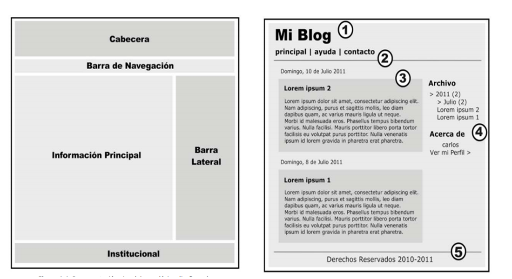

# Introduccion a HTML
:wink: :wink: :wink: :wink: 
## Head
 > Aqui va a ir toda la funsionalida para el navegador, aqui vamos a encontar las etiquetas 'script','style','title'.

## Body
> Aqui  se va encontar todo lo visible para el usudario, en este apartado vana poder ser visible los cambios hechos.

---

## Estructura del HTML



### Encabezado

Como podemos ver aqui, tenemo el encabezado del sitio Web, aqui podemos encontar las diferentes etiquetas de h1,h2,h3...h6, que se utilizaran para el titulo.

```html
    <header>
        <h1>Mi sitio Web</h1>
    </header>
```
>`header` -> Se usa esta etiqueta para contener el titulo del la pagina, es su mayoria se encuentra el h1.

### Navegacion

``` html
 <nav>
        <ul>
            <li>Manzada</li>
            <li>Pera</li>
            <li>Fresa</li>
        </ul>
        <ol>
            <li>Angel</li>
            <li>Luis</li>
            <li>Pepe</li>
        </ol>
    </nav>

```
>`ul` -> Es el que nos va a dar listas no ordenada.

>`ol` -> Es el que nos va mostar las listas ordenadas "enumeradas".

### Cuerpo

``` html
<section>
        <h2>Parte 1</h2>
        <article>
            <h3>Sub_Informacion</h3>
            <p>Lorem ipsum dolor sit amet, consectet</p>
        </article>
    </section>
```

>`section` -> Es la etiqueta padre, es la que engloba todo el contendo y asi poder tenemos una mejor distribucion del contenido de la pagina.

>`article` -> Es la etiqueta que va contener todo el contendo del cuerpo.

>`p` -> Es la etiqueta que se usa pare tener todo el texto estructurado.

### Pie de pagina

``` html
<footer>
    <h4>Gracias por tu Visita</h4>
    <p>Derechos de autor</p>
</footer>
```

>` footer` -> Es usado para dar una estructura el pie de pagina, es el que va en capsular todo el contenido 
