# Javascript 

<div style="display: flex; justify-content: space-evenly; margin-bottom: 25px;">
  
  
  
</div>
> Hay que entender que javascript, es un legunaje de programacion, que soporta POO, es un lenguaje interpretado. Yo lo describo a javascript como un java, moderno .

> Vamos a ver  toda la estructura de javascript, como es su variables, array, funsiones, toda su forma de declarar, para luego hablar de DOM, en otro capitulo.

## Tipo de valores
> A diferencia de otros lenjuages javascript, tuvo un cambio avismal y es algo dificil de entender al inicio como funsiona.

```JAVASCRIPT
var saludo = "hola mundo"
let saludo = "hola mundo"
const saludo = "hola mundo"
```

> `var`, es una tipo de variable global ("que tienes un valor a y dentro de una funsion sigue tendo ese mismo valor a"), esto puede provocar, una confusion a la hora de usarlo.

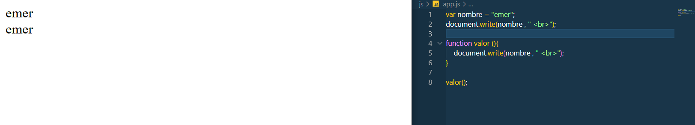

>`let` es un tipo de llamado, que solo funsiona en un lugar especifico, si lo usas en una funsion, ese valor sera valido en esa funsion

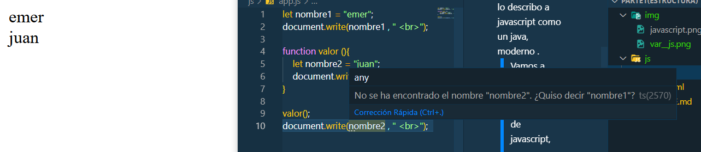

> `const`, es un tipo de declaracion, que no se puede modificar, es intocable en otras palabras 


## Array y Objetos

### Array

> Un array, es como una caja donde se puede guardar valores de cualquier tipo, para luego acceder a ellos por medio de posiciones.

```JAVASCRIPT
 let frutas = ["pera", "manzana", "uva", "fresa"]
 document.write(frutas[1])
```

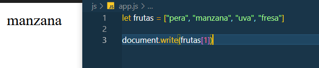

### Objetos

> Como ya lo dije, es como una caja, pero su diferencia es que podemos darle una especificacion, a cada valor.


```JAVASCRIPT
let computadora = {
  ram: "16GB",
  espacio: "1TB",
  procesador: "intel"
}
```

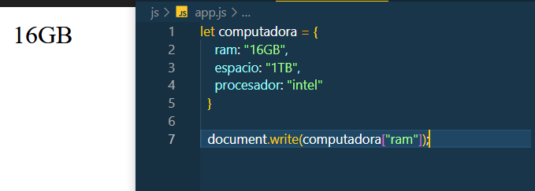

> Hay propiedades que nos van a permitir agregar como eliminar valores de nuestro objeto

```JAVASCRIPT
let computadora = {
    ram: "16GB",
    espacio: "1TB",
    procesador: "intel"
}
computadora.tiempo =  2016;
console.log(computadora);

delete computadora.tiempo;
console.log(computadora);
```

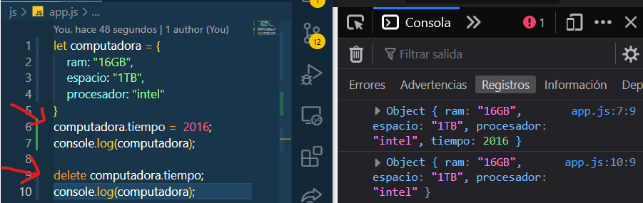


> En este apartado vamos a unir dos objetos, para tener solo uno

```JAVASCRIPT
let computadora1 = {
    ram: "16GB",
    espacio: "1TB",
    procesador: "intel"
}

let computadora2 = {
    ram: "8GB",
    espacio: "5TB",
    procesador: "AMD"
}

const unir = {...computadora1,...computadora2};

console.log(unir);
```

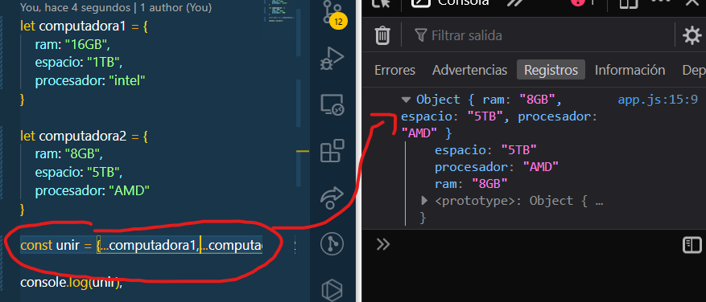;
## Bucles

> Este apartado se divide en multiples partes, tenemos `if, while y for`.De esa manera podemos poner condiciones hasta que cumpla la conficion.

### if

> Es una condicion, que se ejecutara una sola vez, simple u cuando se cumpla la condicion

```JAVASCRIPT

 if(nombre == "emer")
{
  let nombre2= document.write("angel");
}
else if (nombre2 == "angel"){
  document.write("Es simpatico");
}
else{
  document.write("Es humano");
}
```
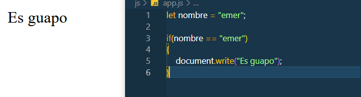
### while

> Es un bucle, repetitivo, es decir que se seguira cumpliendo, hasta que termone la condicion

```JAVASCRIPT

while(true){
  document.write("Hola");
}

```
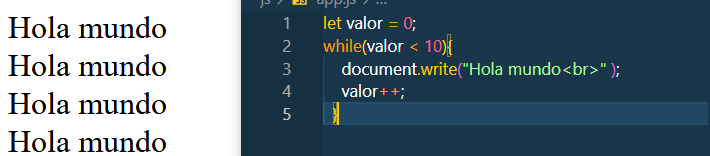

### for

> Es uno de los mejor optimizados, hay algunos que te dan el numero otros el valor `for (in)  y for (of)` , como otros que te devuelven alguna condicion.

```JAVASCRIPT

for (let i = 0; i < 10; i++) {
  document.write("Como estas");
}

```

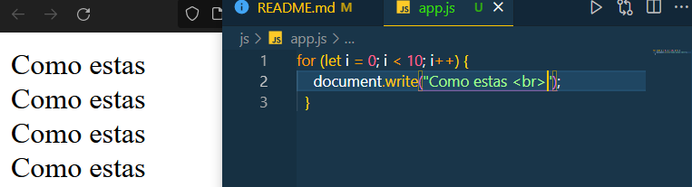


## Funsiones

> `OJO`, diferencia entre un metodo y una funsion

```JAVASCRIPT

const numero1 = 20;
const numero2 = "50";

console.log(numero1.toString());
console.log(parseInt(numero2));

console.log(numero1);
console.log(numero2);
```
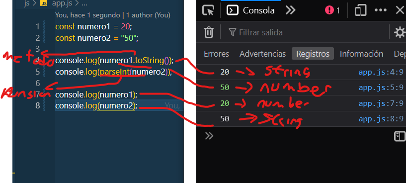


> Partes de una funsion, para entender la logica de una funsion.

```JAVASCRIPT

function valor (n1, n2) {
    return n1 + n2;
}
console.log(valor(1,5))

```
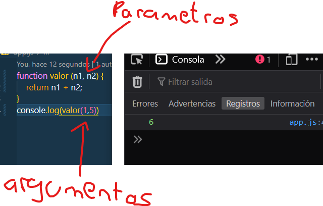

> Es una implementacion, que te permite no repetir codigo, digamos que tenemos que hacer una condicion, con ello solo lo escribimos una sola vez y lo llamanos las veces que desemos.

```JAVASCRIPT
function suma(a, b) {
    document.write(`la suma es ${a + b} <br>`)
}
suma(4, 2);
suma(6, 2);
suma(8, 2);

```
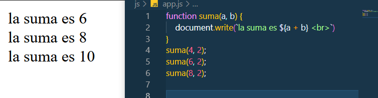

> tenemos una forma de escribirlo diferente y es la forma que hoy en dia se usa mas
```JAVASCRIPT
let suma = ( a , b ) =>{
    document.write(`la suma es ${a + b} <br>`)
}
suma(5,5);
```

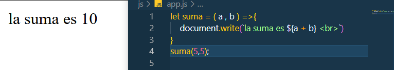

### Funsiones como parametro

> En este caso. lo que sucede es que pasamos una funsion como parametro, lo que nos permite trabajar con ella, por medio de parametro, algo que ayuda mucho a la reutilización de codigo.

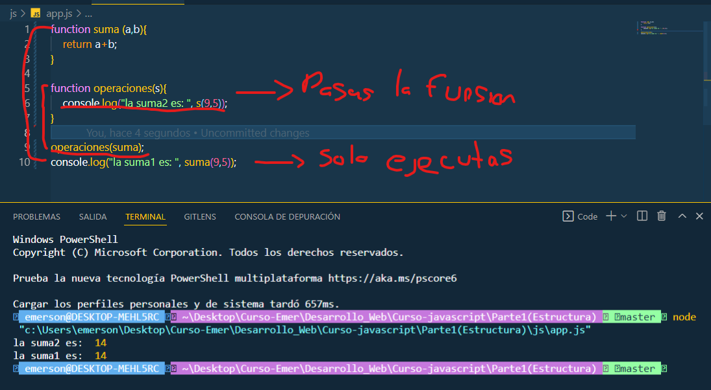

## Clases

### Declaracion

> Aqui se pode interesante, vamos hablar de POO, su funsionamiento y como se debe declarar cada valor, empezaremos por algo siemple para luego llegar a la herencia


```javascript

class Persona{
    constructor(nombre, edad, peso){
      this.nombre = nombre;
      this.edad = edad;
      this.peso = peso;
    }
    mostrar(){
        document.write(`Mi nombre es ${this.nombre}, mi edad es ${this.edad} y mi peso es ${this.peso}`);
    }
      

  }
  
let persona1 = new Persona("juan", 20, 50);
persona1.mostrar();

```

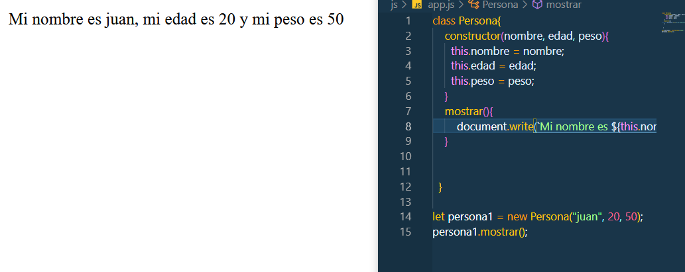


### Herencia

> Aqui vamos a ver el uso de POO, que lo usaras mucho, a la hora de hacer tus programas y aqui te lo voy a enseñar

> Consiste, que el hijo heredara toda las propiedades del padre, asi no tendras que escribir todo de nuevo, ademas puede tener sus propias funsiones. 

```javascript
class Persona{
    constructor(nombre, edad, peso){
      this.nombre = nombre;
      this.edad = edad;
      this.peso = peso;
    }
    mostrar(){
        document.write(`Mi nombre es ${this.nombre}, mi edad es ${this.edad} y mi peso es ${this.peso} <br>`);
    }
  }
let persona1 = new Persona("juan", 20, 50);
persona1.mostrar();

class Hijo extends Persona {
    constructor(nombre, edad, peso, trabajo) {
        super(nombre, edad, peso);
        this.trabajo = trabajo;
    }
    contenido(){
        super.mostrar();
        document.write(`mi trabajo es ${this.trabajo} <br>`);
    }
}
let persona2 = new Hijo("juan", 20, 50, "Software");
persona2.contenido();

```

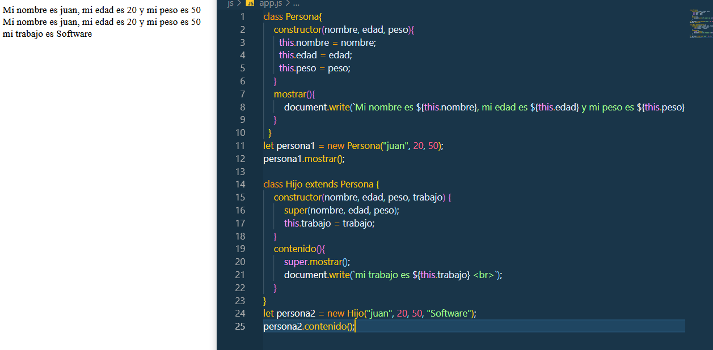