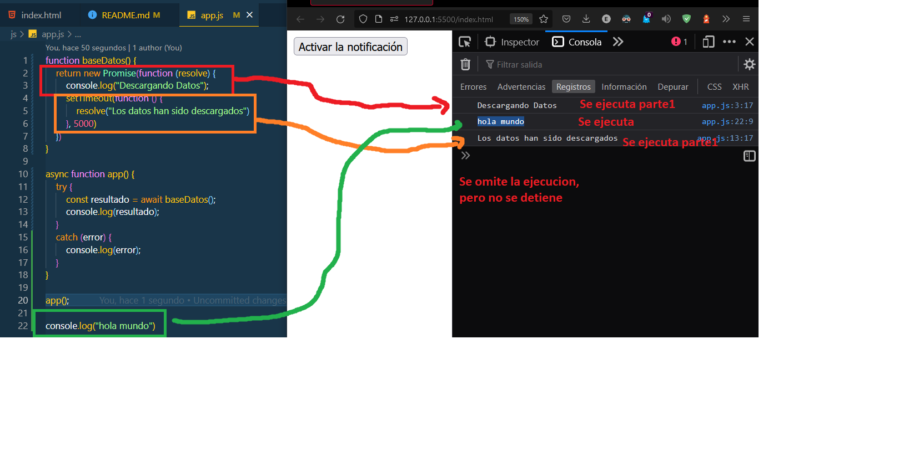

# Javascript 

<div style="display: flex; justify-content: space-evenly; margin-bottom: 25px;">
  
  
  
</div>

> En este punto se tocara sobre la estructura de JS y vamos tener ejemplos de  API, PROMESAS y ASYNC/AWAIT, que nos van a permitir sacar una mejor utilidad al javascript.

## Promesas
<br>

>Consiste en casos que, esta en espera, se a cumplido  o no se a cumplido. Cada caso tiene su forma de ejecución, lo cual nos da paso a nuevas utilidades en un futuro.

<br>

> Esto se divide en tres condiciones, `fulfilled -> resolve()`, la expresion es verdadera, `regected -> reject()`, la expresion es falsa y por ultimo `pending`, que seria como no completado "ni verdadero ni falso".


```JAVASCRIPT
const nuevoValor = new Promise(function (resolve, reject) {
    const valor = false;
    if(valor) {
        resolve(`Es valor es ${valor}`); 
    }
    else {
        reject(`Es valor es ${valor}`);
    }
})

nuevoValor
    .then( resultado => console.log(resultado))
    .catch( error => console.log(error))
```
<br>


## API Notificacion

> En este caso, vamos a validar, usando promesas, si temeos permiso de mostrar notificaciones.

```JAVASCRIPT
const boton = document.querySelector('#boton');
boton.addEventListener('click', function(){
    Notification.requestPermission()
        .then(function(resultado) {
            console.log(`El resultado es ${resultado}`)
        })
})

if(Notification.permission == "granted"){
    new Notification (" Asi se ejecuta");
}
```
<br>


## ASYNC / AWAIT

> Consiste en darle un tiempo a la hora de ejecutar el codigo, pero que no interrumpa, con las demas ejecuciones.. es como si omite la ejecución, y lo muestra hasta que este lista.

```JAVASCRIPT
function baseDatos() {
    return new Promise(function (resolve) {
        console.log("Descargando Datos"); // Ejecuta
        setTimeout(function () {
            resolve("Los datos han sido descargados")
        }, 5000) // pasusa de  tiempo
    })
}

async function app() { // Omitir 
    try { // Omitir 
        const resultado = await baseDatos(); // Omitir 
        console.log(resultado); // Omitir 
    }
    catch (error) { // error
        console.log(error);// error
    }
}

app();

console.log("hola mundo") 
```
