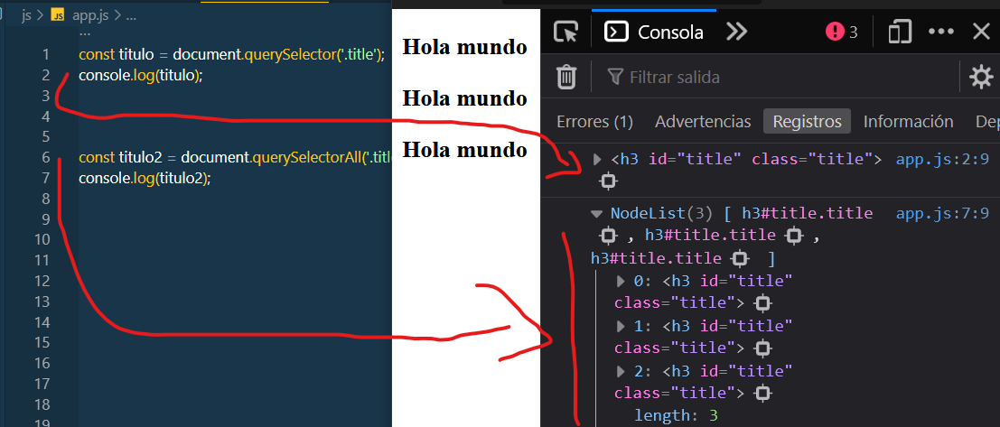

# DOM

> Es la promiedad de javascript, que te permite manipular los elementos del HTML, con diferentes objetos

## Seleccion de Elementos

> Aqui, vamos a ver como podemos seleccionar elementos del HTML, por medio de propiedades `.document`. El mas usado y que se recomienda es "`querySelector`"

> Si es una clase es `querySelector(.titulo)`


>Si es una id es `querySelector(#titulo)`


> Si es una etiqueta es `querySelector(h3)`

```HTML
    <h3 class="title" id="title"> Hola mundo</h3>
    <h3 class="title" id="title"> Hola <b>mundo</b></h3>
    <h3 class="title" id="title"> Hola <b>mundo</b></h3>
    <h3 class="title" id="title"> Hola <b>mundo</b></h3> 
```

```JAVASCRIPT
    const titulo = document.querySelector('.title').value;
    console.log(titulo)

    const titulo2 = document.querySelectorAll('.title');
    console.log(titulo2);

```

> ` document.querySelector`: solo toma 1 o 0 , que quiero decir, que solo tomara la primera etiqueta 

> ` document.querySelectorAll`: tomara todas las etiquetas del HTML, lo pondra en un Array

