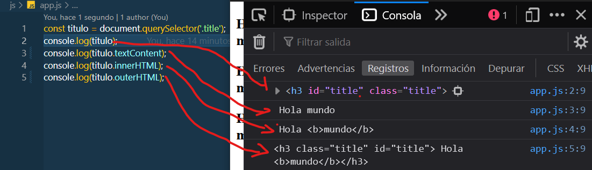
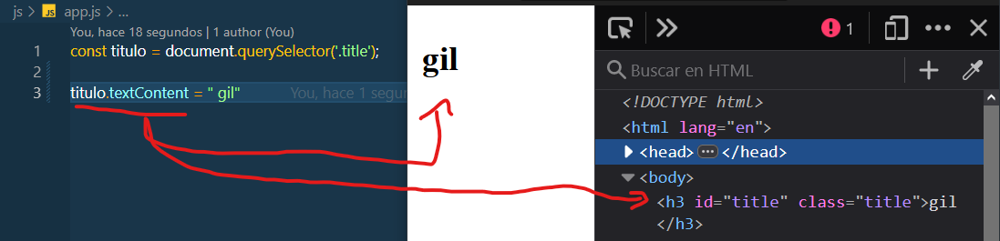
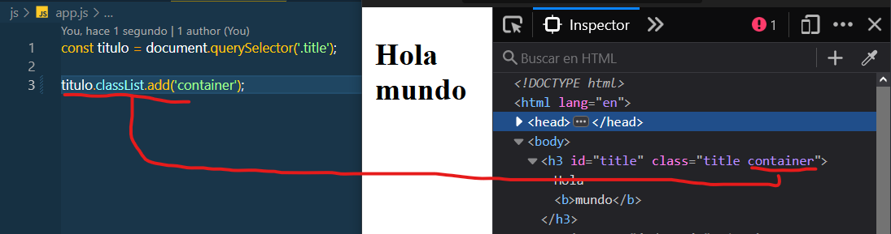
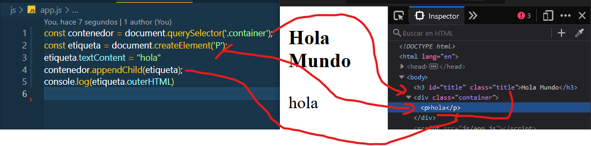
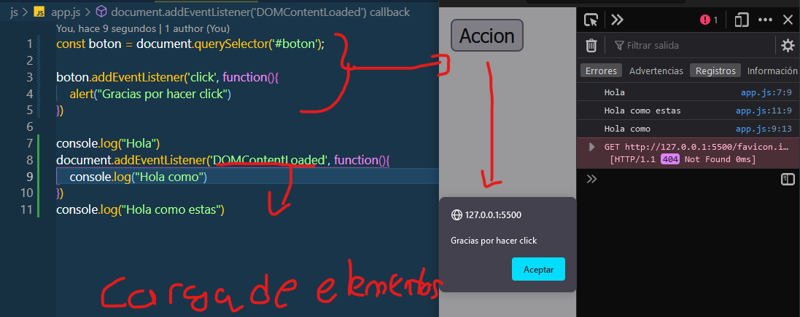
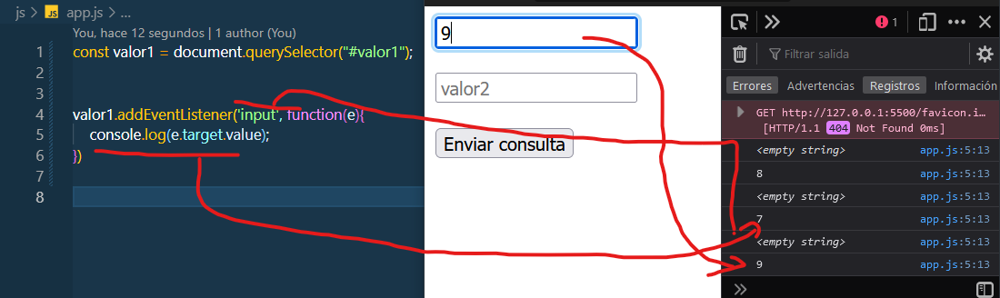

# DOM

> Es la promiedad de javascript, que te permite manipular los elementos del HTML, con diferentes objetos

## Seleccion de Elementos

> Aqui, vamos a ver como podemos seleccionar elementos del HTML, por medio de propiedades `.document`. El mas usado y que se recomienda es "`querySelector`"

> Si es una clase es `querySelector(.titulo)`


>Si es una id es `querySelector(#titulo)`


> Si es una etiqueta es `querySelector(h3)`

```HTML
    <h3 class="title" id="title"> Hola mundo</h3>
    <h3 class="title" id="title"> Hola <b>mundo</b></h3>
    <h3 class="title" id="title"> Hola <b>mundo</b></h3>
    <h3 class="title" id="title"> Hola <b>mundo</b></h3> 
```

```JAVASCRIPT
    const titulo = document.querySelector('.title').value;
    console.log(titulo)

    const titulo2 = document.querySelectorAll('.title');
    console.log(titulo2);

```

> ` document.querySelector`: solo toma 1 o 0 , que quiero decir, que solo tomara la primera etiqueta 

> ` document.querySelectorAll`: tomara todas las etiquetas del HTML, lo pondra en un Array


## Mostrar el contenido de las Etiquetas

> Con el objeto de `document.textContent`, vamos apoder el contenido de la etiqueta.

>`document.textContent`: Te mostrara el contenido de la etiqueta

>`document.innerHTML`: Te va a mostrar el contenido de la etiqueta, pero si ese contenido tiene alguna etiqueta mas, lo va a mostar

>`document.outerHTML`: te va a mostrar toda la etiqueta

```JAVASCRIPT
const titulo = document.querySelector('.title');
console.log(titulo);
console.log(titulo.textContent);
console.log(titulo.innerHTML);
console.log(titulo.outerHTML);

```



## Modificar el contenido HTML 

> Gracias a objetos  de javascript, podemos modicar el contenido que se va a mostrar por pantalla.

>`document.textContent`: con esta propiedad, vamos a poder modificar el contenido de la etiqueta.

```JAVASCRIPT
    const titulo = document.querySelector('.title');
    titulo.textContent = " gil"
```



## Agreamos clases a las etiquetas

> Como lo voy mencionaqndo, hay objetos que te permiten crear u agregar valor a tus etiquetas ya existentes.

```JAVASCRIPT
    const titulo = document.querySelector('.title');
    titulo.classList.add('container');
```




## Vamos a crear nuevas etiquetas

> Gracias a este objeto, vamos a implementar nuevas etiquetas desde js. Hay que tener en cuenta algunas restricciones, como tener un contenedor para la etiqueta creada, si no, no sera posible agregarlo al HTML.

```JAVASCRIPT
    const contenedor = document.querySelector('.container');
    const etiqueta = document.createElement('P');
    etiqueta.textContent = "hola"
    contenedor.appendChild(etiqueta);
    console.log(etiqueta.outerHTML)

```



## Eventos

> Que es un evento? Es un suceso, que se efectuara, al cumplirse una accion.

### Eventos por Navegador

> Aqui nos vamos a referir, cuando el usuario haga click, en un boton, esto permitira realizar una accion. `boton.addEventListener('click', function())`

> Hay eventos, que permiten cargar todo los elementos del HTML, para asi ser visible. `document.addEventListener('DOMContentLoaded', function())`

```JAVASCRIPT
const boton = document.querySelector('#boton');

boton.addEventListener('click', function(){
    alert("Gracias por hacer click")
})

console.log("Hola")
document.addEventListener('DOMContentLoaded', function(){
    console.log("Hola como")
})
console.log("Hola como estas")

```




### Eventos por Teclado

> Aqui vamos a capturar lo que el usuario va a ingresar y vamos a validar o hacer alguna operacion, con los valores ingresados por el usuario

```HTML
    <form>
    <input type="text" id="valor1" placeholder="valor1">    
    <br><br>
    <input type="text"id="valor2" placeholder="valor2">
    <br><br>
    <input type="submit">
</form>
```


```JAVASCRIPT
const valor1 = document.querySelector("#valor1");
valor1.addEventListener('input', function(e){
    console.log(e.target.value);
})


```

