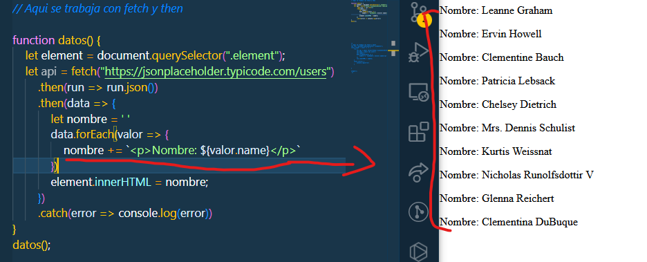

# Primeros Pagos En Apis

>Aqui vamor a ver dos tipos formas de trabajar con APIs, la primera sera por medio de fetch con .then y la segunda por medio de fetch  con async y await, que desde mi pundo es mi preferida.

## Fetch con .then

```JS
function datos() {
    let element = document.querySelector(".element");
    let api = fetch("https://jsonplaceholder.typicode.com/users")
        .then(run => run.json())
        .then(data => {
            let nombre = ' '
            data.forEach(valor => {
                nombre += `<p>Nombre: ${valor.name}</p>`
            })
            element.innerHTML = nombre;
        })
        .catch(error => console.log(error))
}
datos();
```

