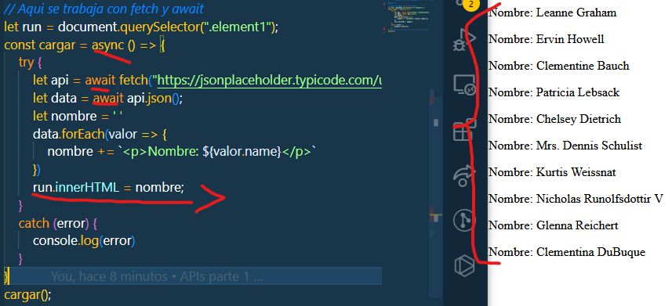

# Primeros Pagos En Apis

>Aqui vamor a ver dos tipos formas de trabajar con APIs, la primera sera por medio de fetch con .then y la segunda por medio de fetch  con async y await, que desde mi punto de vista es mi preferida.

> Uno de las condiciones que en todo los casos vamos a ver, es el uso de fetch.

> La segunda condicion es que se debe parchar con el comando .json(), para asi poder acceder a los datos 

> La tercera mas que condicion es una recomendacion, es el uso del forEach, para poder recorrer los Array, aqui estoy poniendo unos ejemplos de su forma de usar.


## Fetch con .then

```JS
function datos() {
    let element = document.querySelector(".element");
    let api = fetch("https://jsonplaceholder.typicode.com/users")
        .then(run => run.json())
        .then(data => {
            let nombre = ' '
            data.forEach(valor => {
                nombre += `<p>Nombre: ${valor.name}</p>`
            })
            element.innerHTML = nombre;
        })
        .catch(error => console.log(error))
}
datos();
```


## Fetch con async e await

```JS
let run = document.querySelector(".element1");
const cargar = async () => {
    try {
        let api = await fetch("https://jsonplaceholder.typicode.com/users");
        let data = await api.json();
        let nombre = ' '
        data.forEach(valor => {
            nombre += `<p>Nombre: ${valor.name}</p>`
        })
        run.innerHTML = nombre;
    }
    catch (error) {
        console.log(error)
    }
}
cargar();
```
