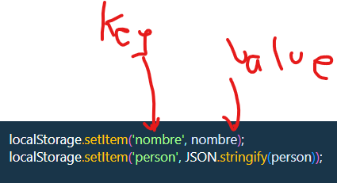
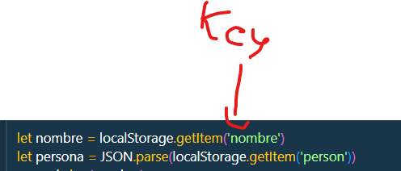
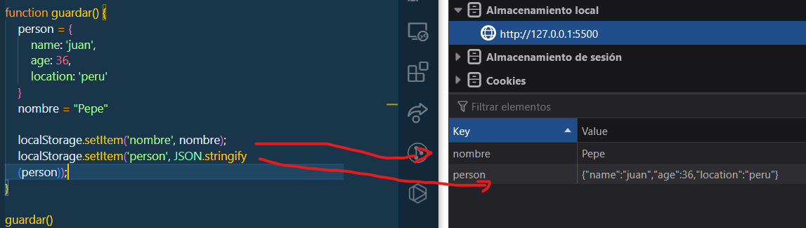
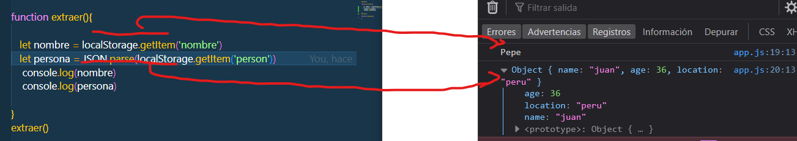
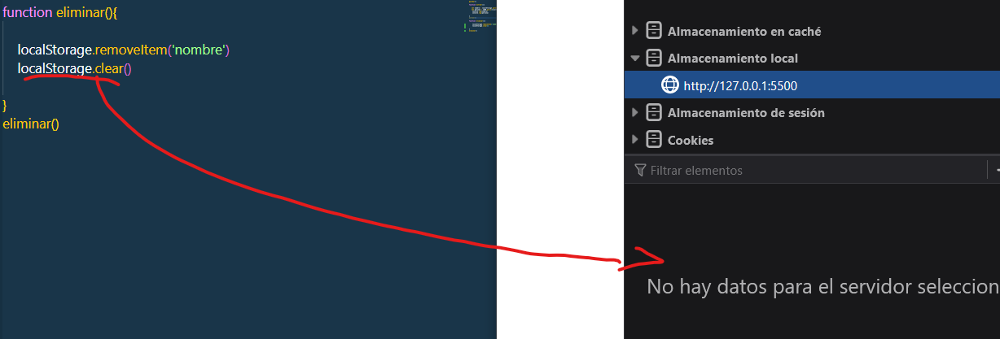

# Bienvenido al LocalStorage

> Vamos a ver las tres maneras de como interactuar con el localStorage, para guardar datos, extraer datos y borrar datos.

> Sabemos que para guardar datos, se le pone un KEY y el nombre de la variable 



> Para extraer o borrar, solo importa el KEY
> 

## Guardar datos en el LocalStorage

```js
function guardar() {
    person = {
        name: 'juan',
        age: 36,
        location: 'peru'
    }
    nombre = "Pepe"

    localStorage.setItem('nombre', nombre);
    localStorage.setItem('person', JSON.stringify(person));
}
guardar()

```


> Hay dos formas de en enviar datos al localStorage, la primera es el "setItem", la segunda es igual pero con una diferencia que es una valor Objeto, hay que pasarlo a JSON, para asi poder leerlo.


## Extraer datos del LocalStorage

> Aqui vamos extraer los datos para mostrarlos por pantalla o consola, para propiedad es "getItem"


```js

function extraer(){
   let nombre = localStorage.getItem('nombre')
   let persona = JSON.parse(localStorage.getItem('person'))
    console.log(nombre)
    console.log(persona)
}
extraer()
```


## Eliminar Datos y Limitar el LocalStorage

> Usaremos dos comandos, "removeItem", este esliminara solo un elemento, Mientras que ".clear", limpiara todo el localStorage

> localStorage.removeItem

```js

function eliminar(){
    localStorage.removeItem('nombre')
}
eliminar()
```


> localStorage.clear

```js
function eliminar(){
    localStorage.clear()
}
eliminar()
```
