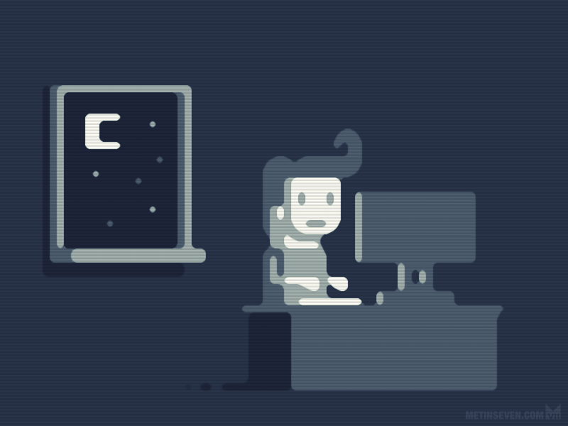

# Introduccion al Desarrollo Web

    
    
      
    

## HTML

>  En este apartado vamos hablar de como se va a maquetar un sitio web, partiendo desde la cabezera hasta el pie de pagina, de esta manera podras hacer tus paginas web desde cero, vas a encontar el contenido para que lo puedas descargar.

` Parte 1`

> Se  hablar de como se debe estructurar tu sitio web, parte por parte , asi tendras una idea general y como funsiona cada etiqueta.

` Parte 2`

> Se habla sobre "class", "id", "tablas", "enlaces" y "formularios" de esa forma vas tener una idea general de sus utilidades, asi podras implementarlo en tu sitio web.

## CSS

`Parte 1`

> Se habla, como funsiona cada etiqueta, la sintaxis y como debes usar css, algunos tips, que te permiten una mejor preforma.

`Parte 2`

> Vamos hablar, del posicionamiento, de los elementos, gracias a las propiedad de position y display.
## JavaScrpit

`Parte1`

> Se hable de como se la sintaxis del lenguajede Javascript, nombramos las varibles, funciona, etc, como lo mensione es toda la sintaxis que vas a usar en algun momento

`Parte2`

>Aqui ya tocamos temas mas avanzados, como promesas, API, ASYNC y algo de validacion, son temas muy puntuales, que en algun momento lo vas a usar. 

`Parte3`

> Son las acciones que el usuario, va a realizar y nosotros como programadores, vamos a capturas y realizaremos la operacion.

######  Avance

* [x] html
* [x] css
* [x] javascript

